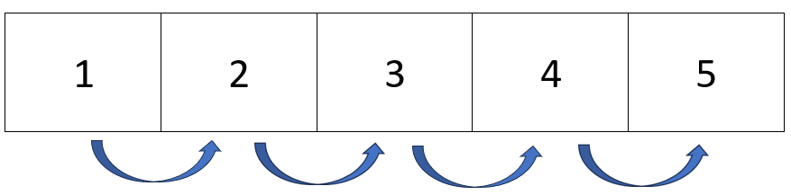
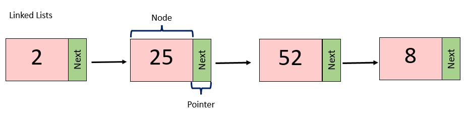
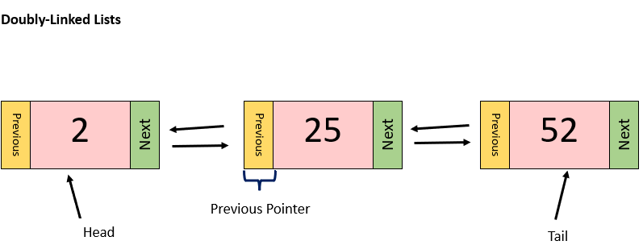
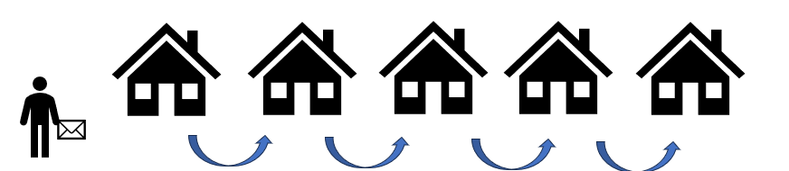
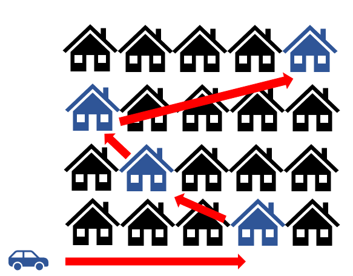

# Linked Lists

Most data structures in python are stored, using what's known as contiguous memory. That means that items in the data structure are stored right next to each other in memory. This makes finding the next item in the data structure easy, since the next item is guaranteed to be in the memory slot right next to the item you are currently on.

Linked lists are NOT structured this way. Items in the list might be stored at different parts of the memory, and are thus, more difficult to find. This is where the 'links' in linked lists come into play. At the end of each item in a linked list, also known as a NODE, there is a link, or a POINTER, giving directions to where the next node is in the memory. It is also important to note that the first node in a linked list is called the HEADS, while the last node in a linked list is called the TAIL.

There are also linked lists that are bi-directional, meaning that each node has a pointer to the next node AND the previous node. This is known as a DOUBLY-LINKED LIST, and is the type of linked list we will use the most often in this tutorial.

## Real World Application

Let's use a real world example to better understand linked lists. We can compare data structures with contiguous memory, (arrays, maps, lists), to a mailman delivering mail to houses on a street. It is easy for the mailman to find the next house because it is right next door to the house they just delivered mail to. 

The structure of a linked list is similar to how a pizza delivery driver would deliver pizzas. When delivering pizzas, it is very unlikely that everyone on the same street ordered a pizza. In most cases, pizza delivery drivers have to drive across town to deliver their next pizza. In this example, the node, or the current item in the linked list, is represented by the houses that receive pizza from the delivery driver. The pointer, or the link to the next node in the list, is represented by the directions to the next house on the delivery route; the directions tell the driver exactly where the next house is in the city, similar to how pointers tell the computer exactly where the next node is in the linked list. 

