# Linked Lists

Most data structures in python, such as lists, maps, and arrays, are stored using what's known as contiguous memory. This means that items in the data structure are stored right next to each other in memory. This makes finding the next item in the data structure easy, since the next item is guaranteed to be in the memory slot right next to the item you are currently on.

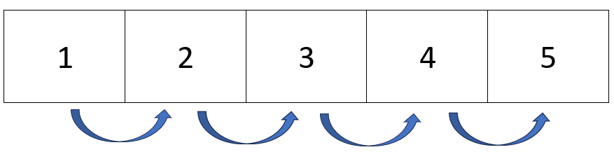

In the real world, data structures with contiguous memory are similar to a mailman delivering mail to houses on a street. It is easy for the mailman to find the next house because it is right next door to the house they just delivered mail to. 


Linked lists are NOT structured this way. Instead, items in a linked list, also known as a __NODES__, are stored at different parts of the memory, and are thus, more difficult to find. This is where the 'links' in linked lists come into play. At the end of each node in a linked list, there is a link, or a __POINTER__, giving directions to where the next node is in the memory.

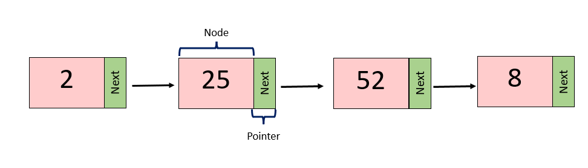

Going back to our real world example, the structure of a linked list is similar to how a pizza delivery driver would deliver pizzas. When delivering pizzas, it is very unlikely that everyone on the same street ordered a pizza. In most cases, pizza delivery drivers have to drive across town to deliver their next pizza. 

In this example, the node, or the current item in the linked list, is represented by the house that receives pizza from the delivery driver. The pointer, or the link to the next node in the list, is represented by the directions to the next house on the delivery route. The directions tell the driver exactly where the next house is in the city, similar to how pointers tell the computer exactly where the next node is in the memory. 

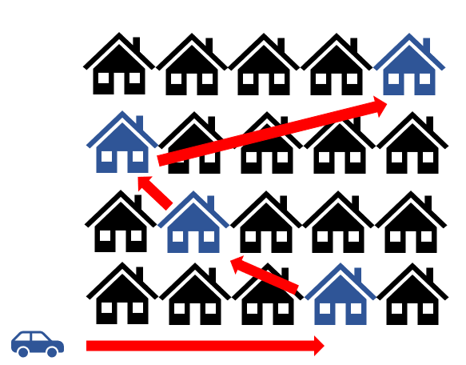 

## Linked List Structure

As previously mentioned, each item in a linked list is called a NODE, and the link pointing to the next node in the list is called a POINTER. 

Besides these two terms, there are other parts of a linked list that are important to remember as well. The first node in a linked list is referred to as the __HEAD__, while the last node is referred to as the __TAIL__.  

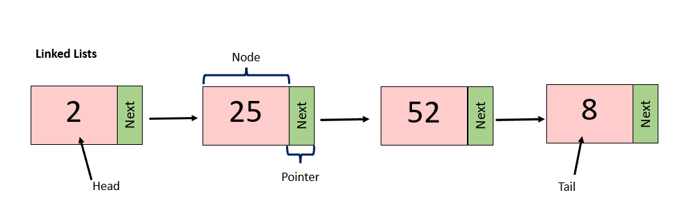

There are also linked lists that are bi-directional, meaning that each node has a pointer to the next node AND the previous node. This is known as a __DOUBLY-LINKED LIST__, and is the type of linked list we will use the most often in this tutorial.

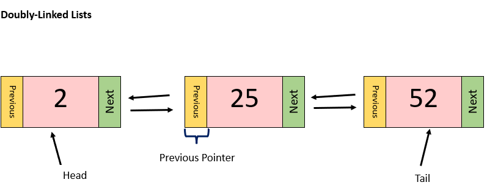


## Creating a Linked List

In python, there are two ways to create a linked list. The first way is to use the __deque__ container from python's collection library. While we will not be going over deque in this lesson, it is still a great tool to use. Below is a helpful link from the website __Geeks for Geeks__ that goes over the basics of the deque container:

[Python's Deque Basics](https://www.geeksforgeeks.org/python-collections-module/?ref=lbp#deque)

The second way to create a linked list in python, is to write a Linked List class. This class will contain methods, or functions, that are necessary to create a linked list. These methods would have the ability to:
- create an empty list
- create a new node 
- insert or delete a node from the list 

In this tutorial, we will go over each step of how to create, insert, and delete from, a linked list using a Linked List class.

## Creating an Empty Linked List

When defining a regular list in python, we simply have to set a variable equal to empty brackets.

```python
# defining an empty regular list
new_list = []
```

With linked lists, it's a little more complex. What makes a linked list different from a regular list, is that it has a head and tail. Whenever we initialize a new linked list, the head and tail need to be defined. Because our list will be empty, there will not be a head or a tail to define. So, in our init method in the LinkedList class, we need to set the head and the tail equal to None.

```python
# defining an empty linked list
def __init__(self):
    self.head = None
    self.tail = None
```
Now, whenever we call the LinkedList() class, a new, empty linked list will be created.

## Creating a New Node
Before we learn how to insert nodes into a linked list, we first need to learn about the properties of a node, and how to create one. When comparing the two, nodes in a linked list are more complex than items in a regular list, due to the fact that nodes have two pointers (previous and next), as well as a value, while items in a regular list just have a value. Because each of these two pointers have their own value, there needs to be a way to insert all three values at once into the list. 

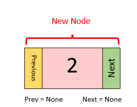

The best way to do this is to create a node object that contains all three properties:
- The value (pink)
- The value of the "next" pointer (green)
- The value of the "previous" pointer (orange)

To do this, we need to create a Node class that can initialize this object when called. Since nodes are a property of a linked list, we need to define the Node class inside the LinkedList class:

```python
# initialize the LinkedList class
class LinkedList:
    # initialize the Node class
    class Node:
```
The init function in the Node class is where we will define the three properties of a node:

```python
class Node:
    def __init__(self, value):
        # define the main value
        self.value = value
        # define the value of "next"
        self.next = None
        # define the value of "prev"
        self.prev = None
```
Since we don't yet know where in the linked list this node will be, we set the pointers to None. These can be changed as we update the list.

Up to this point, we have defined the LinkedList and the Node classes, and have written each of their init functions. Your code should look similar to this:

```python
class LinkedList:
    #create the Node class
    class Node:
        def __init__(self, value):
        # define the main value
        self.value = value
        # define the value of "next"
        self.next = None
        # define the value of "prev"
        self.prev = None
    
    # creating an empty linked list
    def __init__(self):
        self.head = None
        self.tail = None
```

## INSERTING into a Linked List

Now, let's start inserting nodes into our linked list. When inserting into a linked list, there are three spots we can insert a new node at:

- The Head
- The Tail
- In the Middle

Each of these spots have a different checklist to follow in order to correctly implement the insertion. In our LinkedList class, it would be ideal to create a function for each of these spots (i.e., insert_head, insert_tail, insert_middle) 

### Inserting at the HEAD

Let's start by defining an insert_head function in our LinkedList class that will insert a node at the head, or beginning of the linked list. We will want to pass in a value as a parameter that will be used to create our node:

```python
def insert_head(self, value):

```

To write the rest of the function, we must know that there are 4 steps for inserting a node at the Head of a linked list:

__1. Create a new node__

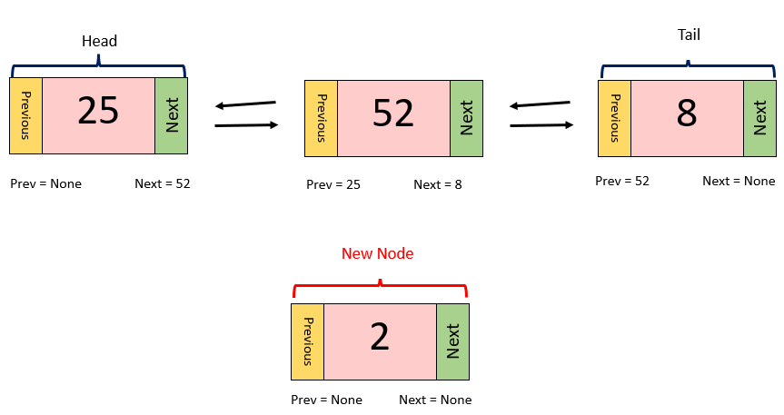

In the example picture above, we see that we have a linked list already populated with 3 nodes: a head, a tail, and a node in the middle. What we want to do is insert a new node, with a value of 2, at the front of the linked list, or the head. For our first step, we need to first create a node that can be inserted into the list. Luckily for us, we have already created a Node class that does just this; we just need to call the class and store it into a variable:

```python
# create a new node by calling the Node class
new_node = LinkedList.Node(value)
```
Since the Node class is a property of the LinkedList class, we must first call the LinkedList class, and then the Node class as shown above. The value we pass into the Node class is the value parameter of the insert_head function we are currently writing. 

__2. Set the "next" pointer of the new node equal to the current head.__

When we created this new node in the line above, the node's pointers were both set to None, due to the default settings of the Node class. Now, since we are inserting this new node at the head, we want its pointers to reflect that of a head node. 

To do this, we will leave the "prev" pointer set to None (since a head node doesn't have anything before it), and we will set the "next" pointer of the new_node equal to the list's current head, as shown below. This will essentially "link" the new_node to the current head.

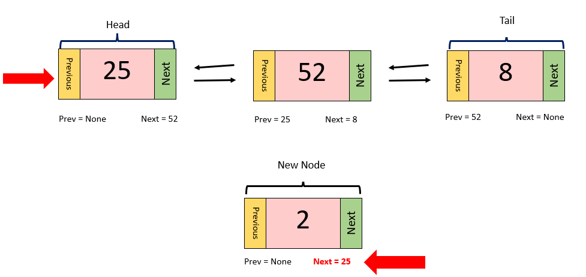

To do this in python, we will set the new_node's property of ".next" equal to the linked list's head, "self.head".

```python
#step 2
new_node.next = self.head
```

__3. Set the "prev" pointer of the current head equal to the new node.__

Since the current head now has a node before it, its "prev" pointer should now equal that new node, the one we just created. 

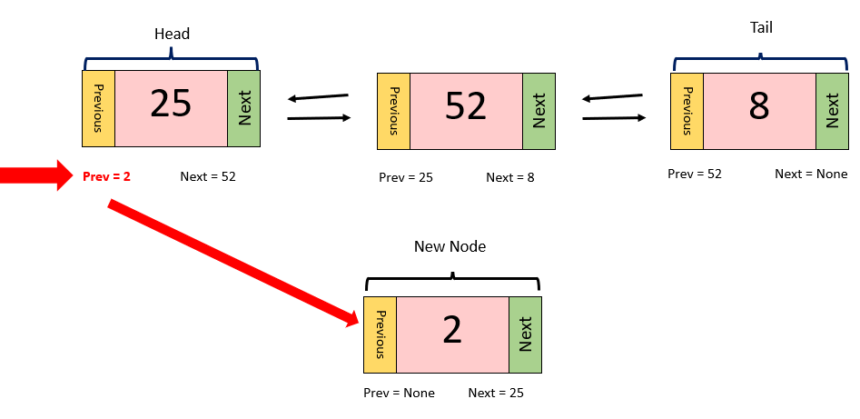

In python, we will change the ".prev" property of the current head to equal the new_node:

```python
#step 3
self.head.prev = new_node
```

__4. Set the head equal to the new node__

When referring to our picture example so far, self.head is still equal to the node with a value of 25. This needs to change, since the new head is the node with a value of 2.

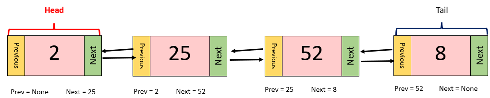

To represent this in python is pretty easy. All we need to do is set self.head equal to our new_node.

```python
#step 4
self.head = new_node
```

After following these 4 steps, your current insert_head function should look like this:

```python
def insert_head(self, value):
    #step 1: Create a new node
    new_node = LinkedList.Node(value)
    #step 2: Set the "next" pointer of the new node equal to the current head.
    new_node.next = self.head
    #step 3: Set the "prev" pointer of the current head equal to the new node.
    self.head.prev = new_node
    #step 4: Set the head equal to the new node
    self.head = new_node
```

#### Empty List Exceptions
The process of inserting a node at the head is a little bit different if there isn't a head to begin with! If you are trying to insert a node into an empty list, set both the head and tail equal to the new node.

```python
self.head = new_node
self.tail = new_node
```

Let's create an if statement in our insert_head function that handles this exception. This if statement will check to see if the linked list is empty after we create a new node. If the list is empty, we will set the head and tail equal to the new_node. If the list is NOT empty, we will then follow the steps to insert the new node at the head. Your insert_head function should now be updated with the new if statement to look like this:

```python
def insert_head(self, value):
    #step 1: Create a new node
    new_node = LinkedList.Node(value)
    
    # if there is no head (meaning the list is empty)
    if self.head is None:
        # set the head and tail equal to the new_node
        self.head = new_node
        self.tail = new_node
    # if there is a head (meaning there is at least one node in the list)
    else:
        # follow the rest of the steps to insert a node at the head
        #step 2: Set the "next" pointer of the new node equal to the current head.
        new_node.next = self.head
        #step 3: Set the "prev" pointer of the current head equal to the new node.
        self.head.prev = new_node
        #step 4: Set the head equal to the new node
        self.head = new_node 
```
### Inserting at the TAIL

The steps for inserting a new node at the tail are very similar to the steps for inserting at the head. We just need to consider the small changes that make inserting at the tail slightly different from inserting at the head:

__1. Create a new node__


__2. Set the "prev" pointer of the new node equal to the tail.__

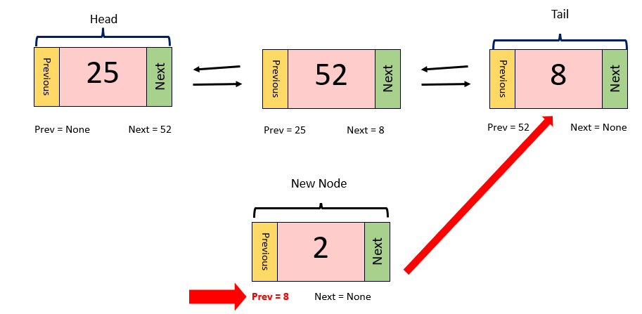

__3. Set the "next" pointer of the tail equal to the new node.__

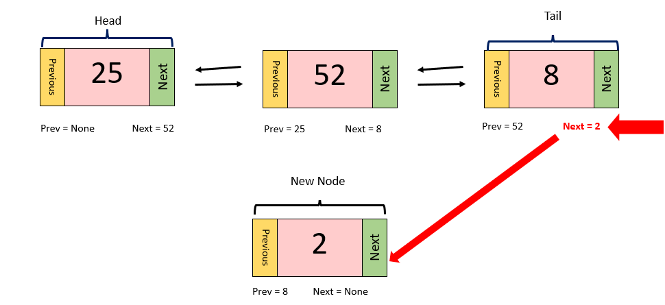

__4. Set the tail equal to the new node__

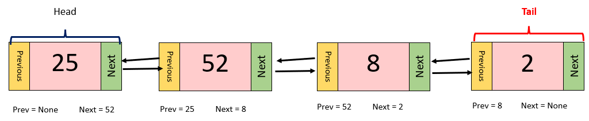

You will be challenged later on in this lesson to write your own insert_tail function, so we will not be writing one here. 

### Big O Notation

It is important to note that inserting at the head, and inserting at the tail each have a performance of O(1).

### Inserting in the MIDDLE

We will now learn how to insert a new node into the middle of the list. The process is a bit more complicated than inserting at the head or tail. 

When defining the insert_middle function, we need to pass in 2 parameters instead of 1:

- value
- new_value

The __value__ represents a value already in the linked list that we want to insert our new node after. The __new_value__ represents the main value of the new node we are creating.

```python
def insert_middle(self, value, new_value):
```

Now, let's go over the steps of inserting a node into the middle of the list. To make our __value__ parameter easier to work with, let's store it into a variable named __current_node__:

```python
current_node = value
```

__1. Create a new node__


This step is exactly the same as the one in the insert_head function. We simply need to store the Node class into a variable called new_node. The value passed into the Node class will be the new_value parameter in our insert_middle function.

```python
#step 1
new_node = LinkedList.Node(new_value)
```

__2. Set the "prev" pointer of the new_node equal to the current_node.__

Let's say our current_node, or the node we are trying to insert our new node after, is the node with a value of 52. If we want our new_node to come after 52, we need to set the "prev" pointer of the new_node equal to 52 as shown below:


In python, we would set new_node.prev equal to the current_node:

```python
#step 2
new_node.prev = current_node
```

__3. Set the "next" pointer of the new_node equal to the "next" pointer of the current_node__

In our example, we are essentially squeezing our new_node of 2, in between nodes 52 and 8. We have already set our new_node's "prev" pointer to 52, now we need to set its "next" pointer equal to 8.

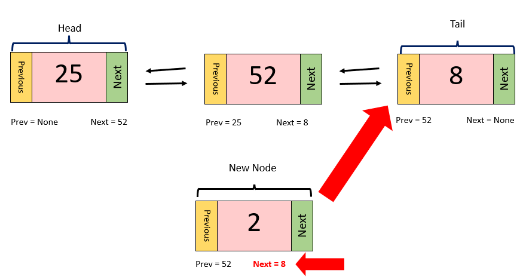

As of now, 8 is the same as our current_node, 52's, "next" pointer (current_node.next). To complete this step, we will set the new_node's next pointer (new_node.next) equal to the current_node's next pointer (current_node.next), as shown below:

```python
#step 3
new_node.next = current_node.next
```

__4. Set the "prev" pointer of the value of the current_node's "next" pointer equal to the new_node.__

This step is a bit of a word jumble, but let's go over it. Now that the new_node is in its new place, we need to change the surrounding nodes to reflect that. As we established in the previous step, the current_node's (52) "next" pointer is equal to 8. Since this node, 8, is now after the new_node we just inserted, we need to change its "prev" pointer to equal to the new node.


We can access the "prev" pointer of the node with the value of 8, by first accessing current_node's "next" pointer as shown below:


```python
#step 4
current_node.next.prev = new_node
```

__5. Set the "next" of the current_node equal to the new_node.__

Lastly, we need to change the current_node's "next" pointer, which is still 8, equal to the new_node, 2. The python example is shown below: 

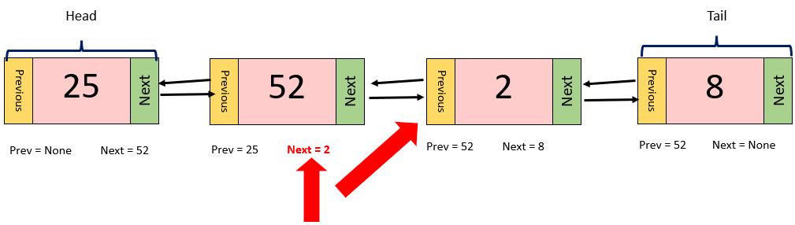

```python
#step 5
current_node.next = new_node
```
Up to this point, your insert_middle function should look similar to this:

```python
def insert_middle(self, value, new_value):
    # store the current_value into a variable named current_node
    current_node = value
    
    #step 1: create a new node
    new_node = LinkedList.Node(new_value)
    #step 2: Set the "prev" pointer of the new_node equal to the current_node.
    new_node.prev = current_node
    #step 3: Set the "next" pointer of the new_node equal to the "next" pointer of the current_node
    new_node.next = current_node.next
    #step 4: Set the "prev" pointer of the value of the current_node's "next" pointer equal to the new_node.
    current_node.next.prev = new_node
    #step 5: Set the "next" of the current_node equal to the new_node.
    current_node.next = new_node
```

### Fixing Limitations

While the function above works well, it does have some limitations we need to fix. For example, what happens if the list is empty? How do we search for the value parameter in the linked list? What do we do if we can't find the value parameter in the linked list? To answer these questions, let's start editing our insert_middle function so that it can handle all of these exceptions. 

Our first problem we run into is that we need to search for the value parameter in the linked list. In our example pictures above, we had the benefit of saying "Okay, let's insert our new node after 52." Making this happen in python is not as simple as that. In reality, we don't know where our value parameter is in the list, or if it's even in the list at all! To find the value, we need to iterate over each node in the linked list, and check to see if its value matches the value we are trying to find. 

As with any form of iteration in python, we need to start at the beginning. In our function, let's change the current_node variable, to equal the linked list's head (self.head):

```python
def insert_middle(self, value, new_value):
   
    current_node = self.head #<<----------
    
    new_node = LinkedList.Node(new_value)
    new_node.prev = current_node
    new_node.next = current_node.next
    current_node.next.prev = new_node
    current_node.next = new_node
```
Next, let's create an if statement that checks to see if the current_node's value is equal to the value we're looking for. If it is equal to the value we're looking for, then perform the steps to insert a new node after it. If it is NOT equal to the value we're looking for, then move on to the next node in the list, by setting current_node equal to the value of the current_node's "next" pointer (current_node.next).

```python
def insert_middle(self, value, new_value):

    current_node = self.head
    
    if current_node.value == value: #<<----------
        new_node = LinkedList.Node(new_value)
        new_node.prev = current_node
        new_node.next = current_node.next
        current_node.next.prev = new_node
        current_node.next = new_node
    else:
        current_node = current_node.next #<<----------
```
We now have a function that iterates through each node in the linked list, and checks to see if the current_node's value is equal to the value we are searching for. But happens if we reach the end of the list, and the current_node's "next" pointer is empty?

To fix this, we can put our if statement inside of a while loop, so that it only runs while there are still nodes left in the list. When the current node is equal to nothing, we will know we have reached the end of the list, and our while loop will stop running. 

```python
def insert_middle(self, value, new_value):

    current_node = self.head
    
    while current_node is not None: #<<----------
        if current_node.value == value: 
            new_node = LinkedList.Node(new_value)
            new_node.prev = current_node
            new_node.next = current_node.next
            current_node.next.prev = new_node
            current_node.next = new_node
        else:
            current_node = current_node.next 
```
While our function currently handles most of our limitations, there is still one more thing we need to add to make it run more efficiently. Right now, our function inserts a new node after a specific node in the linked list. But, what if the specific node we are looking for is the tail? How will our steps need to change then? Luckily for us, we already have a function that handles this (insert_tail). Even though we haven't written our insert_tail function yet, we can still call it in this function, so that it will be ready to use once the insert_tail function is written. 

Within the if portion of our if statement, let's create another if statement that handles the insertion if the current node is the tail. 

** Don't forget to add a __return__ keyword after the inner if statement. We need the return keyword there so that the function can finish after we insert the new node. 

```python
def insert_middle(self, value, new_value):

    current_node = self.head
    
    while current_node is not None:
        if current_node.value == value: 
            if current_node == self.tail: #<<----------
                self.insert_tail(new_value)
            else:
                new_node = LinkedList.Node(new_value)
                new_node.prev = current_node
                new_node.next = current_node.next
                current_node.next.prev = new_node
                current_node.next = new_node
            return # put return here so we can exit the function once we have inserted our new node
        else:
            current_node = current_node.next
```
We now have a properly working function that inserts a node into the middle of the list!

### Big O Notation

It is important to note that inserting a node into the middle of a linked list has a performance of O(n). This is because searching for a node in the list is O(1) and inserting a node in the list is O(1). Two O(1)'s together create a 2O(n), or an O(n).


## REMOVING a Node from a Linked List

The process of removing a node from a linked list is generally a lot simpler than inserting a node, as there are less steps to follow. As with the insertion process, there are 3 places we can remove a node from, each with their own different steps:

- The Head
- The Tail
- The Middle

Let's go over each how to remove a node from each of these places.

### Removing the HEAD

Since we are just removing the head, we do not need to pass a parameter into our function

```python
def remove_head(self):
```

1. Set the "prev" of the second node to None

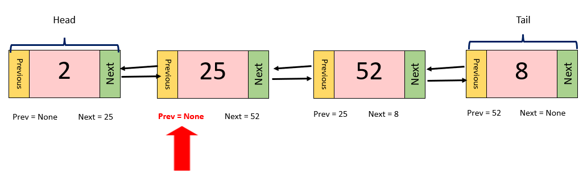

Since we are in the process of making the second node the new head, we will set its "prev" pointer to None. In python, we will access the "prev" pointer of the second node, by first accessing the current head's "next" pointer, as shown below:

```python
self.head.next.prev = None
```

2. Set the head equal to the second node

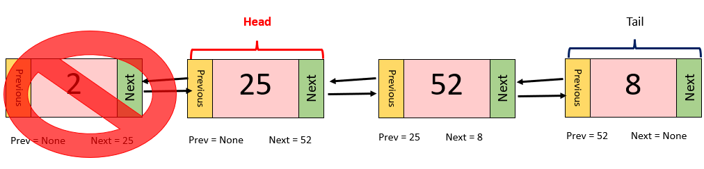

Now that we have set second node's "prev" pointer equal to None, all that's left to do is set the head (self.head) equal to the second node. We will access the second node by once again, first accessing the current head's "next" pointer as shown below:

```python
self.head = self.head.next
```
After completing those two steps, here is what your remove_head should currently look like:

```python
def remove_head(self):
    # step 1: Set the "prev" of the second node to None
    self.head.next.prev = None
    # step 2: Set the head equal to the second node
    self.head = self.head.next
```
### Handling Exceptions

One exception we need to consider when removing the head, is what if there is only one node in the list? We can't set a second node to equal the head if there isn't a second node to being with. 

In our function, let's create an if statement to handle this. In the if portion of the if statement, our condition will check to see if there is only one node in the list (if the head is the same as the tail). Inside the if portion, all we need to do to remove the one node is set both the head and tail equal to None.

```python
if self.head == self.tail:
    self.head = None
    self.tail = None
```
The else portion of our if statement will be the steps we've just written.

Here is what your remove_head function should look like now, with the new if statement:

```python
def remove_head(self):
        # this is the code that is run if there is only one node in the list
        if self.head == self.tail:
            self.head = None
            self.tail = None
        # these are the steps we just went over
        else:
            #step 1: Set the "prev" of the second node to None
            self.head.next.prev = None
            #step 2: Set the head equal to the second node
            self.head = self.head.next  
```

### Removing the TAIL

Here are the steps to remove the tail from a linked list. Similar to how insert_tail is similar to insert_head, remove_tail is similar to remove_head; you just need to take into consideration the fact that you are removing the tail instead of the head.

1. Set the "next" of the second to last node to None

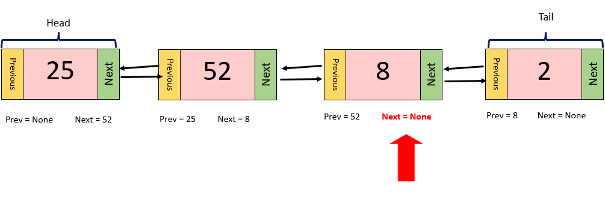

2. Set the tail equal to the second to last node

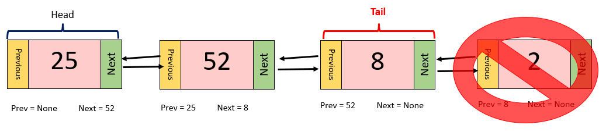

You will be challenged to write the remove_tail function later on in this lesson, so we will not be writing it here. It is important to remember however that the exception handling in remove_head will be very similar to the handling in remove_tail.

### Big O Notation

Removing the head and the tail each have an O(1) performance, since the head and tail are already defined, and don't need to be searched for. 

### Removing from the Middle

Let's say we are trying to remove the node with a value of 2 from the linked list.

1. Set the "prev" pointer of the node after 2 to equal the node before 2.

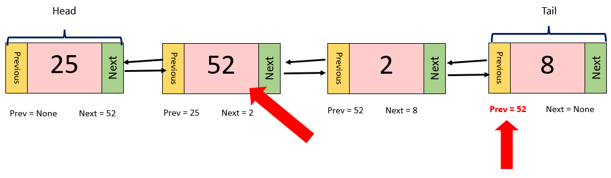

2. Set the "next" pointer of the node before 2 to equal the node after 2. 

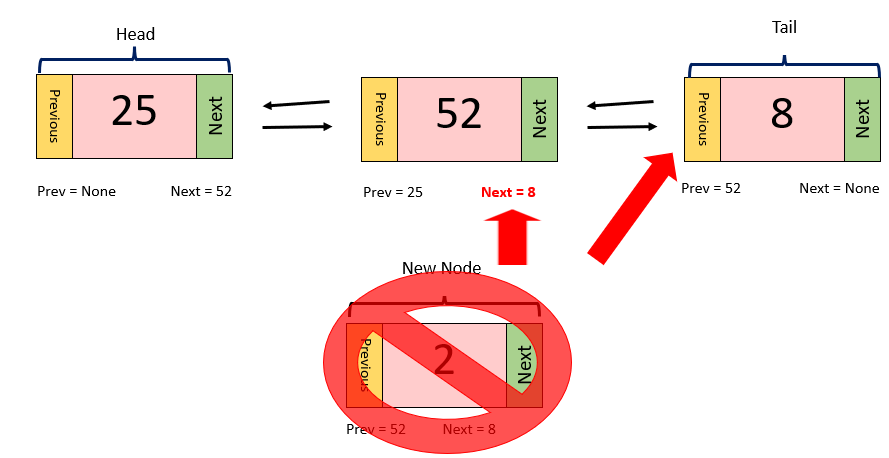

By doing these steps, the linked list essentially squeezes out the node we don't want. This is what the function would look like written in python.

```python
def remove(self, value):
        """
        Remove the first node that contains 'value'.
        """
        curr = self.head #start at the head
        while curr is not None: #while there is a value in the node
            if curr.data == value: #if the current node's data matches the value we're looking for
                #if the value is the tail, we can call the remove tail function to remove it
                if curr == self.tail:
                    self.remove_tail()
                elif curr == self.head: #if the value is the head, then we can call the remove head function to remove it
                    self.remove_head()
                else:
                    #set the next node's preveious link to the node before the current node
                    curr.next.prev = curr.prev
                    #set the node before the current node's 'next' link to the node after the current node
                    curr.prev.next = curr.next
                return #exit the function after you delete the matching node
            curr = curr.next #go to the next node's value if you the current node's value is not a match
```

**Removing a node from the middle of a linked list has a performance of O(n).


