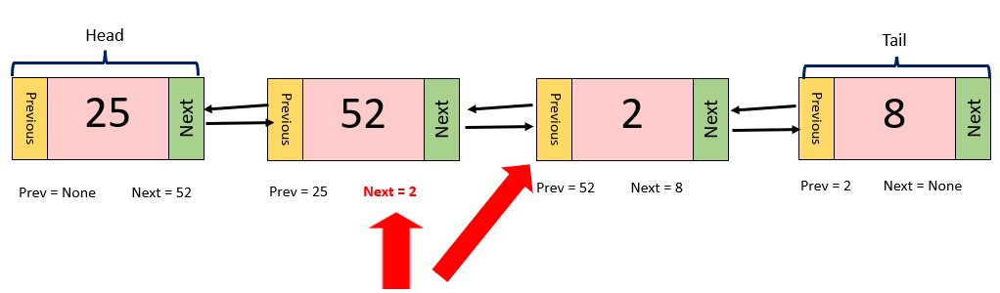

# Linked Lists

Most data structures in python, such as lists, maps, and arrays, are stored using what's known as contiguous memory. This means that items in the data structure are stored right next to each other in memory. This makes finding the next item in the data structure easy, since the next item is guaranteed to be in the memory slot right next to the item you are currently on.


In the real world, data structures with contiguous memory are similar to a mailman delivering mail to houses on a street. It is easy for the mailman to find the next house because it is right next door to the house they just delivered mail to. 


Linked lists are NOT structured this way. Instead, items in a linked list, also known as a __NODES__, are stored at different parts of the memory, and are thus, more difficult to find. This is where the 'links' in linked lists come into play. At the end of each node in a linked list, there is a link, or a __POINTER__, giving directions to where the next node is in the memory.


Going back to our real world example, the structure of a linked list is similar to how a pizza delivery driver would deliver pizzas. When delivering pizzas, it is very unlikely that everyone on the same street ordered a pizza. In most cases, pizza delivery drivers have to drive across town to deliver their next pizza. 

In this example, the node, or the current item in the linked list, is represented by the house that receives pizza from the delivery driver. The pointer, or the link to the next node in the list, is represented by the directions to the next house on the delivery route. The directions tell the driver exactly where the next house is in the city, similar to how pointers tell the computer exactly where the next node is in the memory. 

 

## Linked List Structure

As previously mentioned, each item in a linked list is called a NODE, and the link pointing to the next node in the list is called a POINTER. 

Besides these two terms, there are other parts of a linked list that are important to remember as well. The first node in a linked list is referred to as the __HEAD__, while the last node is referred to as the __TAIL__.  


There are also linked lists that are bi-directional, meaning that each node has a pointer to the next node AND the previous node. This is known as a __DOUBLY-LINKED LIST__, and is the type of linked list we will use the most often in this tutorial.


## Creating a Linked List

In python, there are two ways to create a linked list. The first way is to use the __deque__ container from python's collection library. While we will not be going over deque in this lesson, it is still a great tool to use. Below is a helpful link from the website __Geeks for Geeks__ that goes over the basics of the deque container:

[Python's Deque Basics](https://www.geeksforgeeks.org/python-collections-module/?ref=lbp#deque)

The second way to create a linked list in python, is to write a Linked List class. This class will contain methods, or functions, that are necessary to create a linked list. These methods would have the ability to:
- create an empty list
- create a new node 
- insert or delete a node from the list 

In this tutorial, we will go over each step of how to create, insert, and delete from, a linked list.

## Creating an Empty Linked List

When defining a regular list in python, we simply have to set a variable equal to empty brackets.

```python
# defining an empty regular list
new_list = []
```

With linked lists, it's a little more complex. What makes a linked list different from a regular list, is that the head and tail need to be defined when the linked list is initialized. Because our list will be empty, there will not be a head or a tail to define. So, in our init method in the LinkedList class, we need to set the head and the tail equal to None.

```python
# defining an empty linked list
def __init__(self):
    self.head = None
    self.tail = None
```
Now, whenever we call the LinkedList() class, a new, empty linked list will be created.

## Creating a New Node
Before we learn how to insert nodes into a linked list, we first need to learn about the properties of a node. When comparing the two, nodes in a linked list are more complex than items in a regular list due to the fact that nodes have two pointers (previous and next), as well as a value, while items just have a value. Because each of these two pointers have their own value, there needs to be a way to insert all three values at once into the list. 


The best way to do this is to create a node object that contains all three properties:
- The value (pink)
- The value of the "next" pointer (green)
- The value of the "previous" pointer (orange)

To do this, we need to create a Node class that can initialize this object when called. Since nodes are a property of a linked list, we need to define the Node class inside the LinkedList class:

```python
# initialize the LinkedList class
class LinkedList:
    # initialize the Node class
    class Node:
```
The init function in the Node class is where we will define the three properties of a node:

```python
class Node:
    def __init__(self, value):
        # define the main value
        self.value = value
        # define the value of "next"
        self.next = None
        # define the value of "prev"
        self.prev = None
```
Since we don't yet know where in the linked list this node will be, we set the pointers to None. These can be changed as we update the list.

Up to this point, we have defined the LinkedList and the Node classes, and have written each of their init functions. Your code should look similar to this:

```python
class LinkedList:
    class Node:
        def __init__(self, value):
        # define the main value
        self.value = value
        # define the value of "next"
        self.next = None
        # define the value of "prev"
        self.prev = None
    
    # creating an empty linked list
    def __init__(self):
        self.head = None
        self.tail = None
```

## Inserting into a Linked List

When inserting into a linked list, there are three spots we can insert a new node at:

- The Head
- The Tail
- In the Middle

Each of these spots have a different checklist to follow in order to correctly implement the insertion.

### Inserting at the Head

These are the steps for inserting a node at the Head of a linked list:

1. Create a new node


2. Set the "next" pointer of the new node equal to the current head.


3. Set the "prev" pointer of the current head equal to the new node.


4. Set the head equal to the new node


If the linked list is empty, then set both the head and tail equal to the new node.

### Inserting at the Tail

The steps for inserting a new node at the tail are very similar to the steps for inserting at the head:

1. Create a new node


2. Set the "prev" pointer of the new node equal to the tail.


3. Set the "next" pointer of the tail equal to the new node.


4. Set the tail equal to the new node


**It is important to note that inserting at the head, and inserting at the tail each have a performance of O(1).

### Inserting in the Middle

Here are the steps for inserting a node into the middle of a linked list. The process is a bit more complicated than inserting at the head or tail:

1. Create a new node


2. Let's say we are trying to insert our new node after the node with a value of 52. To do that, we would need to set the "prev" pointer of the new node equal to 52. 


3. Then, we need to set the "next" pointer of the new node to equal the "next" pointer of 52's node, which is 8.


4. Now, we set the "next" pointer of the new node's "prev" pointer to equal the new node.



5. Lastly, we set the "prev" pointer of the new node's "next" pointer equal to the new node. 


**Inserting a node into the middle of a linked list has a performance of O(n).


## Removing a Node from a Linked List

The process of removing a node from a linked list is generally a lot simpler than inserting a node.

### Removing the Head

1. Set the "prev" of the second node to None


2. Set the head equal to the second node


### Removing the Tail

1. Set the "next" of the second to last node to None


2. Set the tail equal to the second to last node


**Removing the head and the tail each have an O(1) performance. 

**If the node you are removing is the last node in the list, set both the head and tail to None.

### Removing from the Middle

Let's say we are trying to remove the node with a value of 2 from the linked list.

1. Set the "prev" pointer of the node after 2 to equal the node before 2.


2. Set the "next" pointer of the node before 2 to equal the node after 2. 


By doing these steps, the linked list essentially squeezes out the node we don't want. 

**Removing a node from the middle of a linked list has a performance of O(n).


# Python Example

Now, let's practice writing linked lists in python. There are two ways to write linked lists in python:

- Write a LinkedList class
- Use python's built-in deque function

To help visualize how a linked list works, we will only be writing a LinkedList class for this lesson, although the deque function is still just as effective. 

Before we start writing our class, let's first list each of the methods that are going to be in our class:

LinkedList Class
- Node Class
    - initialize the node
- initialize an empty linked list
- insert_head
- insert_tail
- insert_middle
- remove_node

## Initialize the Node Class

Let's first initialize the LinkedList class, and the Node class (which will be initialized within the Node class):

```python

class LinkedList:

    class Node:
        # creates a new node
        def __init__(self, value):
            #value will represent the value of the node
            self.value = value
            #define empty links
            self.prev = None
            self.next = None

```
As you can see in the code above, the __init__ method creates a new node. The value will be the number that is passed into the function, and the pointers will be set to None, since their values will change with each new node we create. Essentially, this function creates the below image from the pictures above:


## Initialize the LinkedList Class

Now that we have written the __init__ function for the Node class, we need to write one for the LinkedList class. This function will be written directly below the Node class, but will not be a part of the Node class. What this __init__ function does, is initialize an empty linked list. The main properties of a linked list that we need to focus on when initializing it, are the values of the head and the tail. Since this linked list is empty, both the head and tail will be set to None.

```python
def __init__(self):
    #create an empty linked list
    self.head = None
    self.tail = None
```
## Insert Head Function

Taking what we learned from the explanation above, let's write the insert_head function. 

1. Create a new node
    ```python
    new_node = LinkedList.Node(value)
    ```
    Here, the init function in the Node class is called to create a new node. The value from the insert_head function is passed into the Node init function.

2. Set the "next" pointer of the new node equal to the head
    ```python
    new_node.next = self.head
    ```
3. Set the the "prev" pointer of the head equal to the new node
    ```python
    self.head.prev = new_node
    ```
4. Set the head equal to the new node
    ```python
    self.head = new_node
    ```

The function should now look like this:
```python
def insert_head(self, value):
    #create a new node
    new_node = LinkedList.Node(value)

    new_node.next = self.head
    self.head.prev = new_node
    self.head = new_node
```
This function is great! One thing we need to consider however, is what will happen if we try to insert a head when the list is empty? We can't set the "next" of a new node to the head if there is no head to begin with. To overcome this problem, let's add an if statement that handles empty linked lists. The finished function should look like this:
```python
def insert_head(self, value):
    #create a new node
    new_node = LinkedList.Node(value)

    #if the list is empty
    if self.head is None:
        #set the head and tail equal to the new node
        self.head = new_node
        self.tail = new_node
    #if it's not empty
    else:
        #follow the steps to insert a new head into the list
        new_node.next = self.head
        self.head.prev = new_node
        self.head = new_node
```
## Insert Middle Function

Let's take the steps we learned from the examples above, to write a function that inserts a node into the middle of a linked list:

1. Create a new node
    ```python
    new_node = LinkedList.Node(value)
    ```
2. Set the "prev" pointer of the new node equal to the selected node (the selected node will be a parameter that is passed into the function).
    ```python
    


