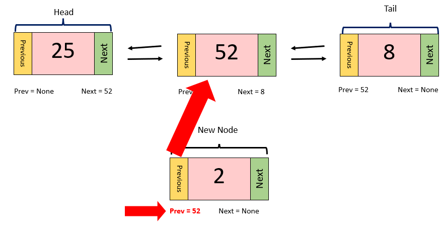

# Linked Lists

Most data structures in python are stored, using what's known as contiguous memory. That means that items in the data structure are stored right next to each other in memory. This makes finding the next item in the data structure easy, since the next item is guaranteed to be in the memory slot right next to the item you are currently on.

Linked lists are NOT structured this way. Items in the list might be stored at different parts of the memory, and are thus, more difficult to find. This is where the 'links' in linked lists come into play. At the end of each item in a linked list, also known as a NODE, there is a link, or a POINTER, giving directions to where the next node is in the memory. It is also important to note that the first node in a linked list is called the HEADS, while the last node in a linked list is called the TAIL.

There are also linked lists that are bi-directional, meaning that each node has a pointer to the next node AND the previous node. This is known as a DOUBLY-LINKED LIST, and is the type of linked list we will use the most often in this tutorial.

## Real World Application

Let's use a real world example to better understand linked lists. We can compare data structures with contiguous memory, (arrays, maps, lists), to a mailman delivering mail to houses on a street. It is easy for the mailman to find the next house because it is right next door to the house they just delivered mail to. 

The structure of a linked list is similar to how a pizza delivery driver would deliver pizzas. When delivering pizzas, it is very unlikely that everyone on the same street ordered a pizza. In most cases, pizza delivery drivers have to drive across town to deliver their next pizza. In this example, the node, or the current item in the linked list, is represented by the houses that receive pizza from the delivery driver. The pointer, or the link to the next node in the list, is represented by the directions to the next house on the delivery route; the directions tell the driver exactly where the next house is in the city, similar to how pointers tell the computer exactly where the next node is in the linked list. 

## Inserting into a Linked List

When inserting into a linked list, there are three spots we can insert a new node at:

- The Head
- The Tail
- In the Middle

Each of these spots have a different checklist to follow in order to correctly implement the insertion.

### Inserting at the Head

These are the steps for inserting a node at the Head of a linked list:

1. Create a new node

2. Set the "next" pointer of the new node equal to the current head.

3. Set the "prev" pointer of the current head equal to the new node.

4. Set the head equal to the new node

If the linked list is empty, then set both the head and tail equal to the new node.

### Inserting at the Tail

The steps for inserting a new node at the tail are very similar to the steps for inserting at the head:

1. Create a new node

2. Set the "prev" pointer of the new node equal to the tail.

3. Set the "next" pointer of the tail equal to the new node.

4. Set the tail equal to the new node

**It is important to note that inserting at the head, and inserting at the tail each have a performance of O(1).

### Inserting in the Middle

Here are the steps for inserting a node into the middle of a linked list. The process is a bit more complicated than inserting at the head or tail:

1. Create a new node

2. Let's say we are trying to insert our new node after the node with a value of 52. To do that, we would need to set the "prev" pointer of the new node equal to 52. 

3. Then, we need to set the "next" pointer of the new node to equal the "next" pointer of 52's node, which is 8.

4. Now, we set the "next" pointer of the new node's "prev" pointer to equal the new node.

5. Lastly, we set the "prev" pointer of the new node's "next" pointer equal to the new node. 

**Inserting a node into the middle of a linked list has a performance of O(n).

## Removing a Node from a Linked List

The process of removing a node from a linked list is generally a lot simpler than inserting a node.

### Removing the Head

### Removing the Tail

### Removing from the Middle

Let's say we are trying to remove the node with a value of 2 from the linked list.

1. Set the "prev" pointer of the node after 2 to equal the node before 2.

2. Set the "next" pointer of the node before 2 to equal the node after 2. 

By doing these steps, the linked list essentially squeezes out the node we don't want. 

# Linked Lists in Python

There are two ways to create a linked list in python:

- Write a Linked List Class
- Use python's deque function

## Writing a Linked List Class

By defining a Linked List class, we can easily call methods of that class such as, insert_head or remove_tail, that can help us create and update our Linked list. The structure of the 

## Inserting into a Linked List

When inserting into a linked list, there are three spots we can insert a new node at:

- The Head
- The Tail
- In the Middle

Each of these spots have a different checklist they have to follow in order to implement the insertion.

### Inserting at the Head

These are the steps for inserting a node at the Head of a linked list:

