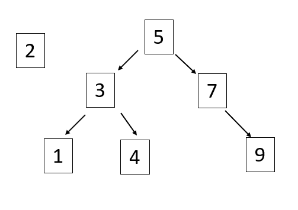

# Trees

Trees are very similar to linked lists in that they both have nodes, and that each node has pointers. What makes them different however, is that trees can connect to multiple different nodes, while linked lists cannot. To help visualize this, think of the structure of a linked list as a chain; each link in the chain can only connect to the link directly in front of it. This singular linkage gives a chain its linear structure, essentially making it one dimensional. 

With this still in mind, let's think of the structure of a tree as, well, a branch on a tree. A tree branch isn't limited to a linear structure like a chain is. Instead, a tree branch can break off into multiple branches, those branches breaking off into their own branches, and so on and so forth. What we have now, is a structure that's more complex both visually and functionally. 

In this lesson, we will be reviewing 3 different types of data structure trees:
- Binary Tree
- Binary Search Tree (BST)
- Balanced Binary Search Tree

## Binary Tree

A __binary tree__ is a tree in which each node can link to no more than two other nodes. The first node in the tree, or the node that is at the very top, is known as the __root__ node. On the other end, nodes that do not connect to any other nodes, and are at the very bottom of the tree, are known as the __leaf__ nodes. If a node is connected to other nodes below it, it is referred to as a __parent__ node, while nodes that are directly connected to, and are below, a parent node, are referred to as a __child__ node. Parent and child nodes are structured similarly to how a parent and child would be displayed in a family tree, with the children branching off from the parent. 


There is one more term to define, and that is __subtree__. When looking at a family tree, you might see a parent displayed with 2 kids. At least one of those 2 kids might have their own kids displayed in the tree as well. In this situation, the child that has their own kids is a subtree. A __subtree__ is essentially a child node, that is a parent to other nodes. As you can see in the image above, the nodes within the red box make up a subtree. 

It is also important to note that nodes can link to other nodes, either before or after them, similar to a linked list. The red and black arrows in the image above represent this.

## Binary Search Tree

A __binary search tree__ (also known as a BST) is the same as a binary tree, except for the fact that there are rules to be followed when entering a new node. When entering a new node into a binary search tree (BST), the value of the node being entered is compared to the value of the root node (**if there isn't a root node, then the new node will become the root node*). If the value of the new node is __less__ than the root node, it goes into the __left__ subtree. If the new node is __greater__ than the root node, it will be placed into the __right__ subtree. Then, depending on whether the new node has been sent to the left or the right subtree, the new node is compared to the root of that subtree, and the process starts all over again until an empty spot can be found. 

Take the following tree for example: 



Let's say that we wanted to insert the node with a value of 2 into the binary search tree. We would first have to compare 2 to the root node, which is 5. Is 2 greater than or less than 5? Since 2 is less than 5, we would start searching in the left subtree.

At this point, the process starts all over again, and we compare 2 to 3. Is 2 less than or greater than 3? Since it is less than, we would again look into the left subtree.

Now we will be comparing 2 to 1. Is 2 less than or greater than 1? Since 2 is greater than 1, it will be going into the right sub tree this time. And, since there isn't a node in 1's right pointer, we will insert 2 there.


This is the process we have to go through every time we insert a node into a binary search tree. 

## Balanced Binary Search Tree

The tree in the example above is what's known as a __balanced binary search tree__. What this means is that the difference in height between the left subtree and the right subtree is less than 2. We can find the height of a tree by counting from the lowest leaf, back up to the root. In the example above, we calculate the height of the left subtree by starting at 2, the lowest leaf, and count up to the root node, 5. 


As you can see, we have counted 4 nodes, meaning that the height of the left subtree is 4.

To find the height of the right subtree, we do the same by starting at 9, the lowest leaf in that subtree, and count back up to the root node.


We have counted 3 nodes, so the height of the right subtree is 3.

Now, we can check the balance of the entire tree by subtracting 3, the height of the right subtree, from 4, the height of the left subtree, getting 1 as a result. Since the difference in height between the two subtrees is less than 2, we can conclude that this tree is a balanced binary search tree. 

But what if the tree is unbalanced? If we're not careful, this could happen easily. Going back to our example, if we were to add a node of 1.5 to the left of node 2, the tree would become unbalanced, since the height of the left subtree is 2 nodes greater than the height of the right subtree. 


This can be fixed using the AVL algorithm. The AVL algorithm, which is short for Adelson-Velskii and Landis, is an algorithm that keeps trees balanced. Whenever the algorithm detetcts that the tree is unbalanced, it will rearrange the nodes to where the tree becomes balanced. In our unbalanced tree example, the AVL algorithm would move 1.5 to where 1 is currently, and would make 1 a child of 1.5, along with 2.


Having a balanced tree is important because, it improves performance. When a binary search tree is unbalanced, it can have a performance of O(n), while a balanced binary search tree has a performance of O(log n).

# Binary Search Trees in python

## How to create an empty BST in python

The steps for creating an empty bst in python are very similar to how we would create an empty linked list. Like linked lists, we will create a BST class that contains methods for creating and inserting nodes into a BST. In the BST class's init function, the only thing we need to initialize is the root, which we will set to none:

```python
def __init__(self):
    self.root = None
```
Also like the LinkedList class from last lesson, we will declare an inner Node class that initializes new nodes. The nodes in a tree have 3 values that need to be initialized, similar to how a node is initialized in a linked list. The only difference is, instead of the pointers being named "next" and "previous", we will be naming them "left" and "right", to represent a node's potential left and right subtrees. As always, we will set the value of the node equal to the value parameter, and set each of the pointers equal to None.

```python
# declare the BST class
class BST:
    # declare the Node class
    class Node:
        
        # this function initializes a new node that we can enter into a tree
        def __init__(self, value):
            
            # initializes the value of the new node
            self.value = value
            # initializes the pointer to the left subtree
            self.left = None
            # initializes the pointer to the right subtree
            self.right = None
    
    # initializes an empty BST
    def __init__(self):
        self.root = None

```
Before we start learning how to insert nodes into a bst, we need to create an **__iter_** function. What this function will do is make our BST class iterable, so that we can print out all of the nodes in the tree. If we didn't put have this function and we tried to print out the items in a tree, python would raise an error saying that our BST() object, or class, is not iterable. So, below the BST class' init function, type the following code:

```python
def __iter__(self):

        yield from self._traverse_forward(self.root)  # Start at the root
        
def _traverse_forward(self, node):
        
    if node is not None:
        yield from self._traverse_forward(node.left)
        yield node.data
        yield from self._traverse_forward(node.right)
```
As you can see in the code above, the iter function calls the __traverse_forward function, and passes in the root. The __traverse_forward function then "traverses" through all of the nodes in the left subtree, and, after it's finished, traverses thorugh all the nodes in the right subtree. Because the function analyzes the left tree first, the nodes will be printed out in order of value, rather than the order they got put into the tree. 

## Insert into a BST

Now we will go over how to write a function that inserts nodes into a binary search tree. To make our code more readable, we will be writing 2 insert functions instead of 1. The first function, we will name __insert__, will check whether or not there is a root node. If there isn't one, a root node will be created; but if there is one, our first function will call on our second function, which we will name **__insert** with a double underscore. This second function will go through the steps to insert a node, similar to how we explained in the introduction; it will keep searching the tree until it finds an empty spot. Let's begin by writing the first insert function.

The main purpose of this function is to check for a root node. The only parameter we need to pass into this function is the value of the new node we want to insert.

```python
def insert(self, new_node):
    # if there isn't a root node, make the value of the new node the root node
    if self.root is None:
        self.root = BST.Node(new_node)
    # if there is a root
    else:
        # call the second __insert function
        self.__insert(new_node, self.root)
```

That's pretty much it for this first insert function; now onto the second one.

This second __insert function is the function that actually does the inserting. It takes the node we want to insert, and compares its value to the other nodes in the tree, until it finds an empty spot, similar to what we did in the introduction. With this in mind, let's think about the parameters we need to pass into this function. Ultimately, the only values we will need, is the value of the node we want to insert, and the value of the node we are currently analyzing. 

```python
def __insert(self, new_node, current_node):
```
Let's now consider what will happen if the new node is less than the current node. As we know with binary search trees, if the new node is less than the node being analyzed, it will go to the left of the current node. If we look at the left node of the current node we are analyzing, there are two options to consider: it could be full or it could be empty. If the left node is empty, it means we have found a spot to insert our new node, and it now becomes the left node.

```python
current_node.left = BST.Node(new_node)
```
If the node is full however, then the process of comparing our new node with the current node has to start all over again, with this left node being the node we compare our new node against. In this instance, it is best to call the __insert function recursively, and pass the left node into the function as the new current_node.

```python
self.__insert(new_node, current_node.left)
```

Putting this if statement together, your __insert function should now look like this, with the option for the left node completed:

```python
def __insert(self, new_node, current_node):

    if new_node < current_node.value:
        # if the left node is empty
        if current_node.left is None:
            # make the new node the new current_node.left
            current_node.left = BST.Node(new_node)
        else:
            # recursively call the __insert function
            self.__insert(new_node, current_node.left)
    
```
## Example Tests

Even though the __insert function isn't quite finished, let's test what we have so far. Start by typing this code below your BST class:

```python
tree = BST()
tree.insert(25)
tree.insert(15)
```
Next, put a break point on the line that has __tree.insert(25)__, and run the debugging tool. Once the debugger has started, click on the "step into" button to see the insert function play out in real time. The debugger should take you to the first insert function. Before you start stepping over the lines, take a look at the variables on the left-hand side of your screen. If you click on the drop-down arrow next to __self__, you will see that the value of the root is equal to None. 


If you start stepping over each line, you will see the function recognize that the root is empty, and insert 25 in its place. To access the root again on the left side of your screen, click on the drop-down arrow next to tree, then the drop-down arrow next to root. Also note that the root's pointers, left and right, are both equal to None. 


The next line, __tree.insert(15)__ should now be highlighted in the debugger. Step into that function as well. You will again be taken to the first insert function, but this time, since the root is full, you will have to enter the second __insert function as shown below.


Step into that function, and watch it play out step by step. Because the left node is empty, 15 will take its place. In the box containing the variables on the left-hand side of the screen, click on the tree and root drop-down arrows again. Instead of being set to None, you will see that the left node is populated. Click on its drop-down arrow, and you will see that its value is 15.


Seeing the left node filled like this confirms that the first part of our insert function is working!

## Now You Try!

We have written the part of the __insert function that handles nodes that are less than the node being analyzed (if new_node < current_node.value). Now it's up to you to write the rest of it! It is important to note that this function does not accept duplicates into the tree, so an exception needs to be written to handle this. You also need to write the exception that handles nodes that are greater than the current node being analyzed. 

When you have finished, use these test functions to see if they worked:

```python
# You should have these already
tree = ()
tree.insert(25)
tree.insert(15)

# Use these new test functions to see if your __insert function works
tree.insert(50)
tree.insert(25)
for x in tree: 
    print(x) #15, 25, 50
    
tree.insert(75)
tree.insert(10)
for x in tree:
    print(x) #10, 15, 25, 50, 75
```

It could also be helpful to use the debugging tool to check your work as well, similar to what we did in the example problem.

Here is the link to the solution:
[Solution](solutions/tree_solution.py)

[Return to Welcome Page](0-welcome.md)